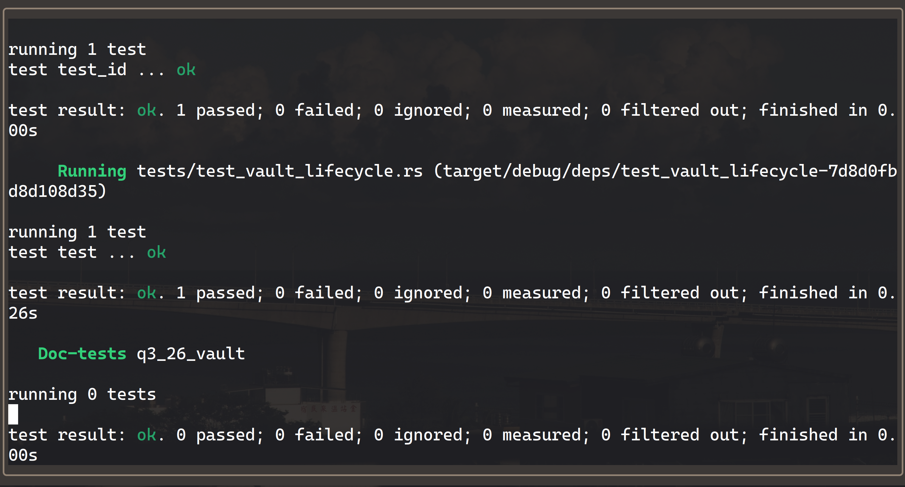

# Vault Program

**Program ID:** `CisEvkF3DJ1f9z5DxtjuEPRRg5FVj67qTCoewwB7NrjG`

## Accounts

Every user has exactly two program-derived accounts.

| Account       | Seeds              | Type                  | Holds                                           |
| ------------- | ------------------ | --------------------- | ----------------------------------------------- |
| `vault_state` | `[b"state", user]` | `Account<VaultState>` | Both PDA bumps — 8-byte discriminator + 2 bytes |
| `vault`       | `[b"vault", user]` | `SystemAccount`       | Lamports only, no data                          |

```rust
#[account]
#[derive(InitSpace)]
pub struct VaultState {
    pub vault_bump: u8,
    pub state_bump: u8,
}
```

Splitting state from funds keeps the vault a plain system account, so lamports move through ordinary system-program transfers rather than manual balance arithmetic. The bumps are stored at initialization and read back on every later instruction, which avoids re-running `find_program_address` on chain.

## Instructions

### `initialize()`

Creates `vault_state` with `user` as payer, funds `vault` to the rent-exempt minimum for a zero-data account (890,880 lamports), and records both bumps.

### `deposit(amount: u64)`

Transfers `amount` from `user` to `vault`. Rejects zero.

### `withdraw(amount: u64)`

Transfers `amount` from `vault` back to `user`, with the vault PDA signing via `CpiContext::new_with_signer`. Rejects zero, and rejects any amount that would leave the vault below its rent-exempt minimum.

That floor means **`withdraw` can never fully drain a vault** — the rent-exempt balance stays parked until the account is closed. Use `close` to recover it.

### `close()`

Drains the vault's entire balance to `user`, then closes `vault_state` via Anchor's `close = user` constraint, returning its rent as well. Both accounts are gone afterward, and `initialize` can be called again from a clean slate.

## Design notes

**The withdraw rent floor exists to keep failures in program space.** Solana's runtime rejects any transaction that moves an account from rent-exempt to rent-paying — a nonzero balance below the exemption threshold. Without the explicit check, a slightly-too-large withdrawal would abort with the runtime's opaque `InsufficientFundsForRent` instead of a program error a client can interpret. The guard uses `saturating_sub`, which matters because the release profile sets `overflow-checks = true`: a plain subtraction would panic on an oversized amount rather than returning the error.

**`close = user` is what makes the vault reusable.** Draining the vault alone would leave `vault_state` on chain holding its rent forever, and since `init` fails on an account that already exists, the user could never re-initialize. Closing the state account returns that rent and restores the ability to start over. Anchor performs the close in its `exit` step, after the handler body, so reading `vault_state.vault_bump` for the signer seeds during the handler remains valid.

**Authorization is a consequence of the seeds, not a separate check.** Because `vault_state` and `vault` both derive from `user.key()`, and `user` is a `Signer`, an attacker who signs in the `user` slot must still pass PDAs that re-derive from _their_ key. Presenting someone else's vault fails Anchor's seeds constraint (error 2006) before the handler ever runs.

## Errors

| Code | Name                | Cause                                                           |
| ---- | ------------------- | --------------------------------------------------------------- |
| 6000 | `InvalidAmount`     | `amount` was zero on deposit or withdraw                        |
| 6001 | `InsufficientFunds` | Withdrawal would leave the vault below the rent-exempt minimum  |
| 2006 | `ConstraintSeeds`   | Anchor built-in: the supplied PDAs don't derive from the signer |

## Layout

```
programs/q3_26_vault/
├── src/
│   ├── lib.rs                      # declare_id! and the four entrypoints
│   ├── constants.rs                # VAULT_SEED, STATE_SEED
│   ├── error.rs                    # InvalidAmount, InsufficientFunds
│   ├── state.rs                    # VaultState
│   ├── instructions.rs
│   └── instructions/
│       ├── initialize.rs
│       ├── deposit.rs
│       ├── withdraw.rs
│       └── close.rs
└── tests/
    └── test_vault_lifecycle.rs     # litesvm integration test
```

## Building and testing

```bash
anchor build
```

```bash
anchor test
```

Tests run against [litesvm](https://github.com/LiteSVM/litesvm) rather than a local validator, so no `solana-test-validator` process is required. The suite loads the compiled `.so` directly and drives it through one full lifecycle.



`test_vault_lifecycle.rs` walks a single user through the whole state machine and asserts on both success and failure paths:

1. `initialize` — `vault_state` exists, `vault` sits at the rent-exempt minimum
2. `deposit` — balance increases by exactly the deposit
3. **unauthorized withdraw** — a second keypair signing in the `user` slot is rejected with `ConstraintSeeds`, and the funded vault does not move a lamport
4. `withdraw` — balance decreases by exactly the amount
5. **rent floor, both sides** — one lamport past the free balance fails with `InsufficientFunds` and rolls back cleanly; draining to exactly the floor succeeds
6. **zero amount** — rejected with `InvalidAmount`
7. `close` — `vault_state` is gone and the vault is empty
8. **re-initialize** — succeeds after close, proving the account is genuinely reclaimed

Pinning the rent floor from both directions is deliberate: testing only the rejection would pass just as well if the comparison were inverted, or if the guard were deleted entirely.
